# Token Bank

> **个人AI中枢 · Token 管家**
>
> 用的明白 · 用的节省 · 用的简单 · 越用越懂你 · 闲置赚钱
>
> 一键纳管 Claude / Cursor / Codex / WorkBuddy · 一站式 Trace 与路由 · 画像驱动资源发现 · 社区分享与远程智能体

[English](./README.md) · [下载最新版](https://github.com/wink-run/tokenbank/releases/latest) · [架构文档](./DESIGN.md) · [隐私政策](./docs/PRIVACY_POLICY.md)

---

## 为什么需要 Token Bank

你可能正被这些问题困扰：

- 订了多家模型，却说不清 Token 每天花在哪、花了多少
- 免费额度闲着，付费账单却涨；本地模型没用上
- 多工具、多账号、多设备对不齐；Skill / MCP / Prompt 越装越乱
- 月末套餐额度清零白浪费

**Token Bank 是你的个人 AI 中枢，** 把 Claude Code、Codex、Cursor、WorkBuddy、Kimi Code 等接入本地网关——不改客户端习惯，把 Token **用的明白、用的节省、用的简单**，并按使用习惯沉淀与发现资源（**越用越懂你**）；闲置算力还能通过**社区分享**换成积分，社区智能体可在对方设备执行（**闲置赚钱**）。

**五条主线：**

| 主线 | 你得到什么 |
|---|---|
| **用的明白** | 一键纳管；全链路 Trace；多维盘点与多设备汇总；订阅 / 按量对照 |
| **用的节省** | 无损换模；智能路由（本地源优先 + 任务分型）；场景策略；可选无损压缩 |
| **用的简单** | 纳管 / 还原一键完成；CLI 多账号按目录分发；托盘常驻；改一个本地地址即可接入 |
| **越用越懂你** | 工作画像；MCP / Skill / Prompt / Agent 个性化发现、沉淀与迭代 |
| **闲置赚钱** | 贡献闲置算力赚积分；**雇佣智能体**；圈子共享与网络地图 |

---

## 技术架构

```
┌─────────────────────────────────────────────────────────────────┐
│  桌面客户端 (Electron · Mac / Windows) 或 CLI / Docker Web UI    │
│  网关 · 供给源 · 资源 · 游乐场 · 盘点 · 圈子 · 贡献 · 托盘      │
└────────────────────────────┬────────────────────────────────────┘
                             │ 本机 loopback
                             ▼
┌─────────────────────────────────────────────────────────────────┐
│  本地网关  :11430/v1                                            │
│  · Anthropic Messages / OpenAI Chat / Codex Responses 协议适配  │
│  · keyScene 换模 · 场景/任务分型路由 · 无损压缩 · 会话 Trace    │
│  · MCP 内置中转（prompts / models / resources / agent-bridge）  │
└───────────────┬─────────────────────────────┬───────────────────┘
                │ 本地源 Key 不出机             │ 登录 + 转发 Key
                ▼                             ▼
     Ollama / 免费 API / 订阅 / 按量      云端 Token Bank 服务
                                             │
                              ┌──────────────┼──────────────┐
                              ▼              ▼              ▼
                         社区模型 P2P    社区智能体派发   多设备用量合并
                         (WebSocket)    (对方设备执行)   圈子 / 目录下发
```

**实现要点：**

| 层次 | 说明 |
|---|---|
| **应用 Handler** | `app-handlers.yaml` 声明式描述 CLI shim / 配置文件 patch / 会话扫描；WorkBuddy、Trae、Hermes、Kimi 等按强信号探测安装态 |
| **路由** | 统一「路由 = Selector 链」：个人/社区/免费/付费来源 + 预定义任务分型（design / repo-qa / chore / debug） |
| **资源投射** | Skill / Prompt / MCP 只写入**已纳管且本机已装**的目标；无 stdio 的应用可走内置 MCP 中转 |
| **数据面** | 网关实时日志 + 本地会话补录（Claude / Codex / Cursor / WorkBuddy Trace 等）自动去重 |

---

## 核心能力：一键纳管 · 无损换模 · 全链路 Trace

Token Bank 不只是转发 API——它把 **Claude Code、Codex、Cursor、WorkBuddy、Kimi Code、OpenClaw** 等主流 Agent 统一纳入本地网关，在**不改动 Agent 本身**的前提下，实现用量追溯、模型切换与智能路由。

### 一键纳管应用

打开 **网关** 页，已安装的工具会自动出现在列表中（也可手动添加桌面包）：

| 应用 | 接入方式 |
|---|---|
| Claude Code / Codex CLI / OpenCode / Hermes / Kimi Code | CLI 透明托管：自动注入 `BASE_URL` 等环境变量，无需改命令 |
| Claude Desktop / Codex Desktop / OpenClaw / WorkBuddy | 配置文件写入：一键 patch 指向本地网关（缺省配置可在强信号确认后首次创建） |
| Trae Work | 会话补录 + 手工填网关参数（IDE 内自定义模型） |
| Cursor / Copilot / Qwen / Grok 等 | 会话统计，或 OpenAI 兼容入口改 `OPENAI_BASE_URL` / 网关专用 Key |

**纳管流程：**

1. 点击 **纳管** → 开始统计该应用的 Token 用量（即使仍直连官方订阅）
2. 在路由下拉框选择 **模型或场景路由** → 自动改写配置，流量走本地网关
3. 点击 **还原** → 恢复官方配置，停止纳管统计

三种状态清晰分离：**仅统计**（官方订阅 + 会话补录）、**走网关**（路由绑定 + 实时代理）、**还原**（恢复原始配置）。

### 主流 Agent 无损切换第三方模型

Agent 继续使用原生模型名（如 `claude-sonnet-4-6`、`gpt-5`），**客户端无需任何改动**：

```
Claude Code 请求 claude-sonnet-4-6
        ↓  网关 keyScene 透明改写
实际路由 → Groq llama-3.3-70b / 本地 Ollama / DeepSeek / …
        ↓  协议适配层
Anthropic Messages ↔ OpenAI Chat ↔ Codex Responses
```

- **模型名不变**：Claude 客户端校验通过，UI 显示不变
- **协议自动转换**：Anthropic `/v1/messages`、OpenAI `/v1/chat/completions`、Codex `/v1/responses` 各自适配
- **按应用独立绑定**：Claude Code 走免费 Groq，Codex 走本地 Ollama，互不影响
- **随时切回官方**：路由选「直连官方」即还原配置，零残留

### 会话 Trace（网关实时 + 会话补录）

无论 Agent 是否走网关，用量都能被完整追溯：

| 模式 | 说明 |
|---|---|
| **网关实时代理** | 请求经 `localhost:11430` 转发，记录路由链、真实模型、Token、延迟、费用 |
| **会话补录** | 纳管但未走网关时，扫描本地会话日志（`~/.claude`、`~/.codex`、WorkBuddy Trace 等）补录用量 |
| **自动去重** | 同一次调用若既走网关又落进会话文件，只记一次 |

Trace 数据在 **盘点** 页按 **应用 · 供给源 · 模型 · 供给类型 · 设备 · 时间** 多维切片，调用日志可查看每条请求的路由结果与耗时。

### 智能路由

供给源分为 **本地源** 与 **社区分享源** 两大类，每个应用可独立绑定路由，全局供给链作为兜底：

```
按应用绑定（keyScene / 场景路由 / 任务分型）
    ↓ 未绑定或 llm-router-* 模型
智能供给链（统一「路由 = Selector 链」）
    本地源：Ollama → 免费 API (Groq / GitHub Models) → 订阅 / 按量 API
    ↓ 本地源不可用或需扩展算力
    社区分享源（消耗积分，调用社区共享算力）
    ↓ 策略组调度
fallback · round-robin · weighted · latency · direct
```

| 供给类型 | 包含 | 说明 |
|---|---|---|
| **本地源** | Ollama、免费 API、APP/API 订阅、按量付费 | 本机网关直连转发，Key 不上云 |
| **社区分享源** | 社区共享算力网络 | 消耗积分调用远程节点，模型列表动态下发 |

- **场景路由**：日常对话、代码补全、长文档分析绑定不同供给链
- **任务分型路由**：预定义 `design` / `repo-qa` / `chore` / `debug` 等 model_key，按任务类型选链（对齐 OpenCode 类推理路由）
- **来源/价格过滤**：可限定仅个人源、仅社区、仅免费或仅付费
- **策略组**：按任务特征（工具调用、上下文长度等）动态选择 provider 顺序
- **故障转移**：本地源不可用时自动尝试社区分享，对 Agent 完全透明
- **出站保护**：按上游模型输出上限夹紧 `max_tokens`，减少协议/限额 400

### 模型模态

供给源模型可标记 **文本 / 图文 / 生图 / 嵌入**，驱动游乐场能力与 Codex catalog 的 `input_modalities`；图文模型才会在客户端暴露图片输入。

### 网关无损压缩

转发前可选开启 **无损 JSON 压缩**，减少发给上游的输入 Token，**不改变模型看到的语义**：

- 压缩消息中 pretty-print 的 JSON（工具返回、嵌入数据等），去掉多余空白
- 非 JSON 内容原样保留，不影响回答质量
- 在 **配置** 页开启，或通过环境变量 `TOKENBANK_COMPRESS=1`
- **盘点** 页展示压缩次数、节省 Token 数与压缩比；多设备登录后云端汇总各端压缩效果

### 多设备用量聚合

桌面版、CLI 版、服务器网关各自注册为独立设备，登录账号后 **用量自动上报并云端合并**：

| 能力 | 说明 |
|---|---|
| **设备注册** | 每台机器自动分配 device_id，60s 心跳保持在线状态 |
| **盘点快照** | 按 1 / 7 / 30 天上报调用、Token、费用、本地源 / 社区分享 分布、Top 模型与应用 |
| **云端合并** | **个人** 页与 **盘点** 页展示各设备占比、在线状态、独立明细与汇总视图 |
| **跨端一致** | 订阅账户、按量配置、工具清单登录后同步，换设备无需重复配置 |

### 个人订阅统一管理

**个人** 页集中管理所有计费账户，与 **供给源** 页的 Key / 路由分工明确：

| 类型 | 管理方式 | 典型场景 |
|---|---|---|
| **APP 订阅** | 登记 ChatGPT / Claude / Gemini / Cursor 等套餐与月费 | 仅统计官方订阅用量，或通过 OAuth 转为 API 供给 |
| **API 订阅** | 独立目录管理厂商 API 套餐（如火山引擎 Coding Plan） | 走 API Key 网关，与 APP 订阅分开核算 |
| **按量付费** | 登记供给源、模型列表与 USD/百万 Token 刊例价 | 供给源页仅可选用此处已配置的模型；费用估算以此为准 |

- **跨设备同步**：登录后订阅与按量配置云端下发，Mac / Windows / Linux 保持一致
- **计费叠加**：订阅按日折算 + 按量刊例价估算，与原始 Token 统计同屏对照
- **供给联动**：个人页定义「用什么、花多少钱」，供给源页定义「怎么接入、怎么路由」

### 动态供给源下发

本地源目录与工具清单无需手动维护版本——**登录即同步，在线即更新**：

```
服务端维护
    ├── 本地源目录（Ollama / Groq / GitHub Models / SiliconFlow …）
    ├── 工具清单 config.apps（Agent 纳管规则、协议适配）
    └── 场景路由 config.scenes（预设路由链）
         ↓  登录 / 启动时自动拉取
本地网关
    ├── 合并写入 ~/.tokenbank/tokenbank.yaml
    ├── 社区分享 在线模型定时刷新（/v1/models → 路由候选）
    └── 一键扫描环境变量，导入已有免费 Key 并轮询
```

- **本地源目录下发**：Groq、Cerebras、GitHub Models、NVIDIA NIM 等预置在供给源页「本地源」，管理员可通过 YAML 热更新
- **社区分享 动态模型**：在线贡献者的模型列表实时拉取，无需本地手动添加
- **环境变量扫描**：一键导入本机已有的 Groq / GitHub Models / Anthropic 等 Key，多 Key 自动轮询
- **离线回退**：未联网时使用内置默认配置，联网后自动合并服务端增量

### CLI 多账号与目录分发

同一 CLI（如 Claude Code / Codex）可挂多个登录账号，网关按**启动目录**自动选实例，互不抢配置：

| 能力 | 说明 |
|---|---|
| **自动扫描** | 启动或手动重扫，发现本机已有 CLI 账号实例并入库 |
| **手工新建** | 网关页「CLI 实例」类型，补录扫描未覆盖的账号 |
| **生效目录** | 多实例时为每个账号指定工作目录；shim 按 `$PWD` 注入对应环境 |
| **额度可视** | 抓取 Claude / Codex 订阅额度，托盘与应用列表展示当日用量 |

### Agent 聚合（游乐场）

**调试 / 游乐场**不再只是单模型对话：

- 设一个**主 Agent**作为聚合入口，接收自然语言任务（支持**图片输入**）
- 主 Agent 可编排步骤，派发至已纳管的其他智能体（含 Kimi / Cursor 等运行时）
- **社区智能体**：在贡献页按需雇佣；任务在**对方设备**执行，不下载对方正文，降低陌生 Agent 风险
- 内置 `tokenbank-agent-bridge` MCP：`tb_list_agents` / `tb_dispatch_agent` 供编排派发
- 对话流按块输出，工具调用可见；支持停止后续接
- 智能体可见性由**运行时投射 + 已纳管**门控：投射了且本机可用才会出现在列表

### 资源中枢：MCP · Skill · Prompt

**资源**页把社区推荐与个人资产收拢到一处：

| 类型 | 能力 |
|---|---|
| **社区目录** | 登录后拉取 MCP / Skill / Prompt / Agent 推荐清单（缓存优先，离线走内置兜底） |
| **投射** | 只投射到**已纳管且本机已装**的目标；可取消；纳管时级联依赖 |
| **内置 MCP 中转** | 无 stdio 通道的应用：选应用 → 绑定 prompts/models/resources → 复制中转配置即可 |
| **Prompt MCP** | Prompt 经 `tokenbank-prompts`（`tb_get_prompt` / `tb_list_prompts`），按投射集过滤 |
| **工作画像海报** | 盘点页可生成四套气质的分享海报（专业 / 可爱 / 幽默 / 简约） |

---

## 五件事

### 一、用的明白

Token Bank 记录每一次调用：走了哪条路由、用了哪个模型、花了多少 Token、延迟多少毫秒。

- **一键纳管盘点**：仅统计 / 走网关 / 还原；按应用汇总请求、Token、费用
- **全链路 Trace**：网关实时 + 会话补录，自动去重
- **多维盘点与多设备**：应用 · 供给源 · 模型 · 费用 · 设备 · 时间；登录后云端汇总
- **订阅 / 按量对照**：APP / API / 按量分栏；日折算 + 刊例价估算与原始 Token 同屏

### 二、用的节省

本机 **智能路由链** 本地源优先，必要时再走社区分享：

```
本地源：Ollama → 免费 API → 订阅 / 按量
    ↓ 不可用或需扩展
社区分享（消耗积分，调用共享算力）
```

- **无损换模**：客户端原生模型名不变，协议自动适配（含 Codex Responses 工具转发）
- **场景 / 任务分型策略**：对话 / 补全 / 长文 / design·repo-qa·chore·debug 可绑不同供给链；故障转移对 Agent 透明
- **无损压缩**：减少上游输入 Token，语义不变

### 三、用的简单

- **网关页一键纳管与还原**，少改配置
- **CLI 多账号**按启动目录自动分发；托盘常驻看状态与今日用量（品牌 logo + 玻璃浮层）
- **OpenAI 兼容入口**：现有工具改一个本地地址即可接入
- **Agent 游乐场**：主 Agent 接任务并派发（含社区智能体），工具流可见

### 四、越用越懂你

- **工作画像**：从真实调用与会话习惯挖掘，可在技能 / 提示词 / 智能体间复用
- **为你推荐**：按画像发现 MCP / Skill / Prompt / Agent
- **沉淀与迭代**：收进个人资产；可复用画像再发现，或重新挖掘；目录不够时可按画像自建

### 五、闲置赚钱

把闲置算力或 API 额度贡献给 **社区分享** 网络，赚取积分，再消费共享模型；也可 **上架 / 雇佣智能体**（任务在对方设备执行，配置与 API Key 不离机）。

**可贡献算力：** 本地 Ollama、闲置上游额度、内网私有模型（出站 WebSocket，无需开放端口）

```
积分 = (输出 Token 数 / 1000) × 模型贡献率 × 质量系数（0.5～1.5）
花费 = (输入 + 输出 Token 数 / 1000) × 模型消费率
```

贡献率 > 消费率；另有签到、转盘、邀请等积分来源。圈子可共享模型与积分。

**雇佣智能体：** 在「贡献」页上架已投射智能体（只公开名片），或按次雇佣社区在线智能体；任务在对方设备执行，本机不落对方正文；也可生成外链落地页供试用。游乐场与纳管应用可直接发起。

---

## 快速开始

### 桌面版（Mac / Windows，推荐）

从 [Releases](https://github.com/wink-run/tokenbank/releases/latest) 下载安装包：

- **macOS** `.dmg` — 双击安装，托盘常驻，支持后台自动更新

  若提示 **「已损坏，无法打开」**（Gatekeeper 拦截，非文件损坏），安装后在终端执行：

  ```bash
  xattr -cr "/Applications/Token Bank.app"
  ```

  然后重新打开。或在「系统设置 → 隐私与安全性」中选择「仍要打开」。
- **Windows** `.exe` — NSIS 安装包，支持后台自动更新；标题栏与壳层主题一致

安装后打开 → 进入「配置」页 → 填写账号服务地址和转发 Key → 完成。

**接入 AI 工具：**

在 Claude Code、Cursor、Open WebUI 等工具中，把 API Base URL 改为：

```
http://localhost:11430/v1
```

API Key 在「网关」页创建本地 Key，或使用你已有的上游 Key。

---

### 命令行版（Linux / 服务器）

```bash
git clone https://github.com/wink-run/tokenbank.git
cd tokenbank/client
npm install
node cli/gateway.js start
```

浏览器打开 `http://localhost:11431` 进行配置，使用方式与桌面版完全一致。

```bash
# 后台运行
nohup node cli/gateway.js start > gateway.log 2>&1 &

# 或用 pm2
pm2 start cli/gateway.js -- start
```

---

### Docker 版（容器化）

```bash
git clone https://github.com/wink-run/tokenbank.git
cd tokenbank

docker compose up gateway -d
```

配置目录 `gateway-data/` 由 Compose 自动挂载；**`local-config.json` 在首次启动时由程序创建**，路由与应用在 `:11431` Web UI 中配置。说明见 [`gateway-data/README.md`](./gateway-data/README.md)。

| 端口 | 用途 |
|---|---|
| `11430` | LLM 请求入口（`OPENAI_BASE_URL=http://host:11430/v1`） |
| `11431` | Web 管理界面 |

---

## 界面预览

### 网关 · 一键纳管与工具箱

应用列表、今日用量，以及 App toolbox 一键安装 / 卸载 Claude Code、Kimi Code、Cursor、Codex 等。

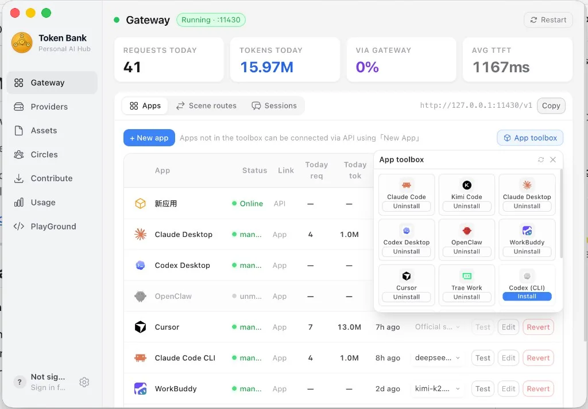

### 会话 · 跨应用统一追溯

按 Claude Desktop / Cursor / Kimi Code / Codex 等过滤，查看会话 Token、费用，支持交接与导出。

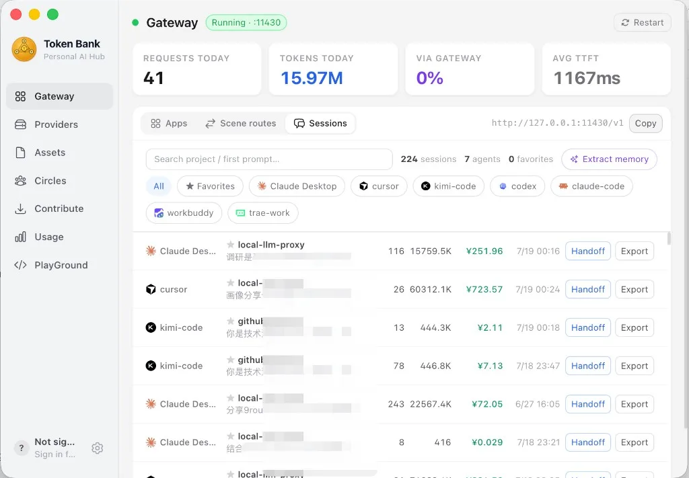

### Session Trace · 步骤级可观测

单次会话的步骤、工具调用、Skill 使用与 Token 明细（含推理密封展示）。

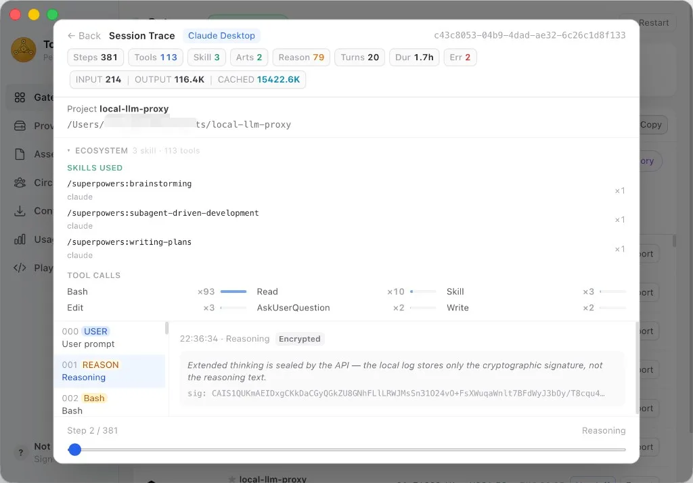

### 供给源 · 个人算力 + 社区分享

个人账户模型测速与状态灯；社区共享模型按积分调用。

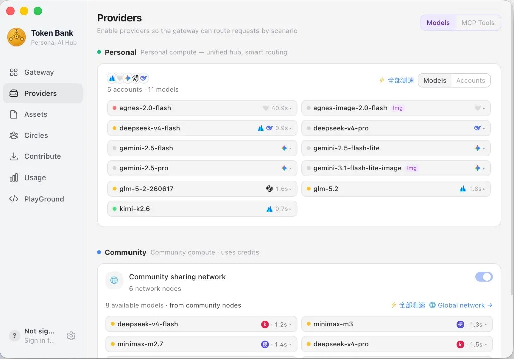

### 资源 · Agent / Skill / Prompt

纳管智能体、投射到运行时 Agent；社区「为你推荐」与工作画像。

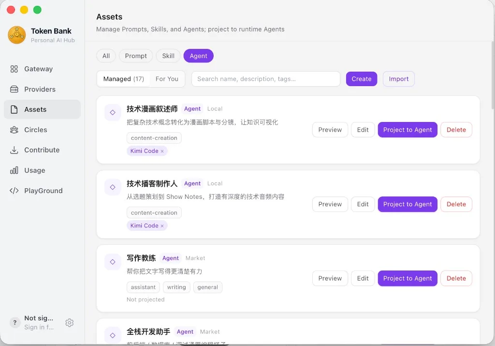

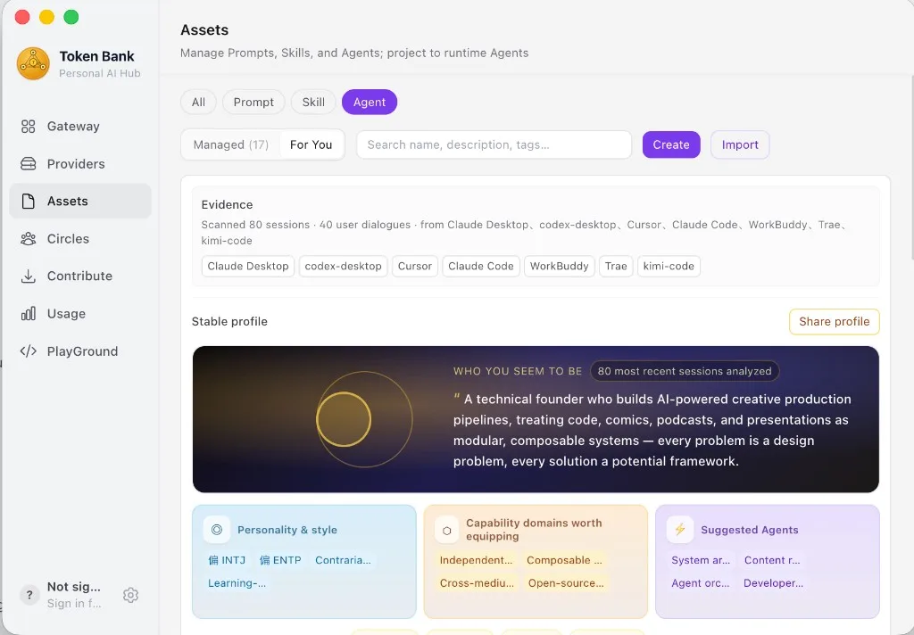

### 游乐场 · Agent 聚合编排

主 Agent 接任务、工具流与终端协同；左侧可选 Claude Code / Codex / Cursor / Kimi Code 等运行时。

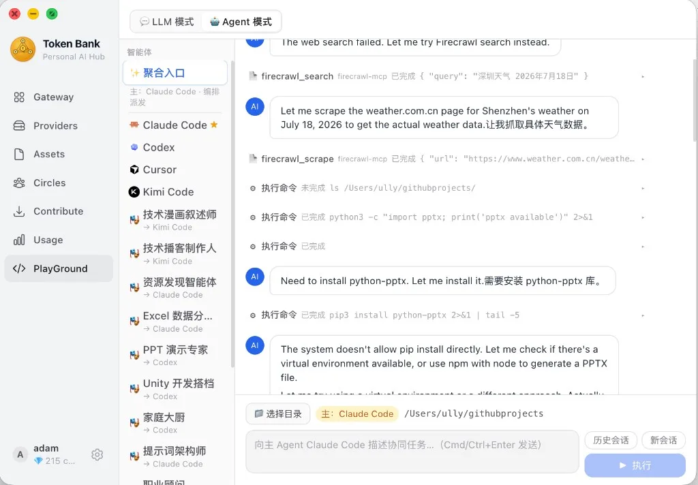

### 盘点 · 用量与费用

请求 / Token / 免费命中率 / 费用估算；按应用分布与今日趋势。

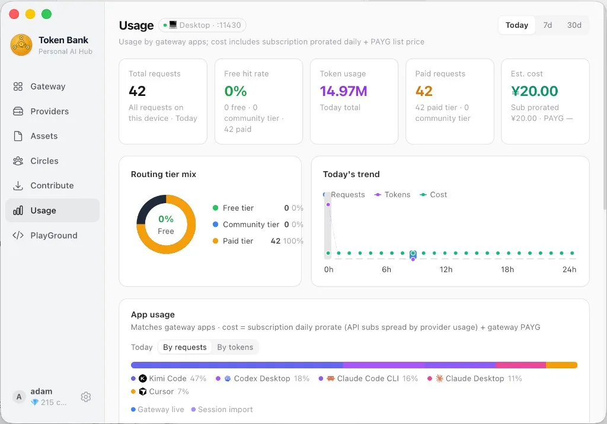

### 圈子 · 同好共享算力

创建或加入圈子，邀请好友共享模型与积分。

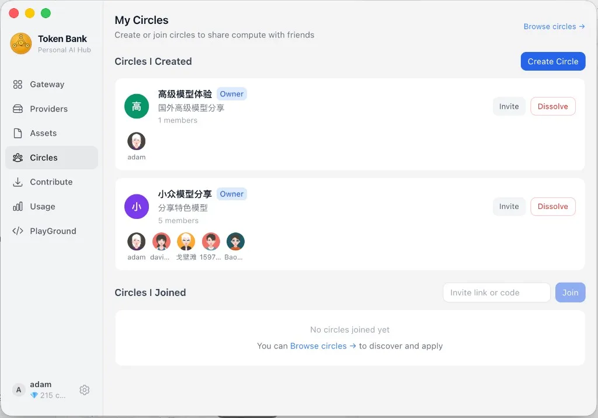

### 贡献 · 闲置额度生息

把本地模型贡献到社区网络赚积分；密钥不上云。也可上架智能体供他人 **雇佣**——只公开名片，配置与 Key 留在本机。

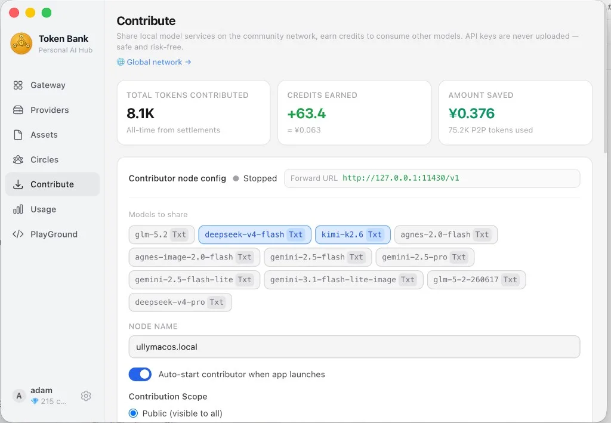

### 全球网络 · 节点地图

在线节点、可用模型与地理分布一览。

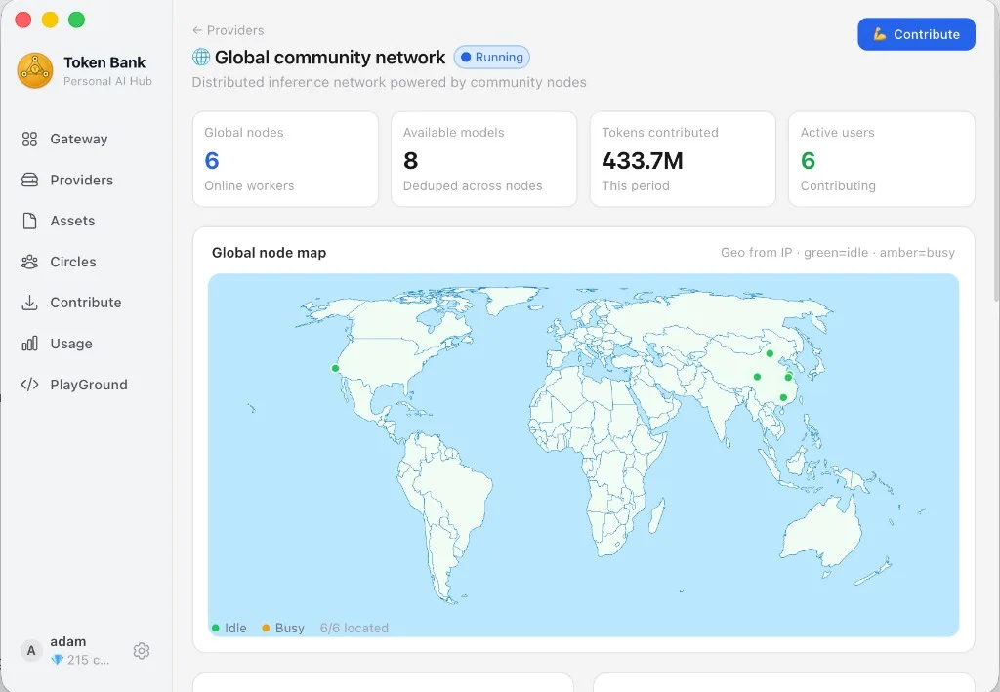

### 托盘 · 常驻速览

网关状态、各应用 TTFT / 今日用量，一键打开主面板。

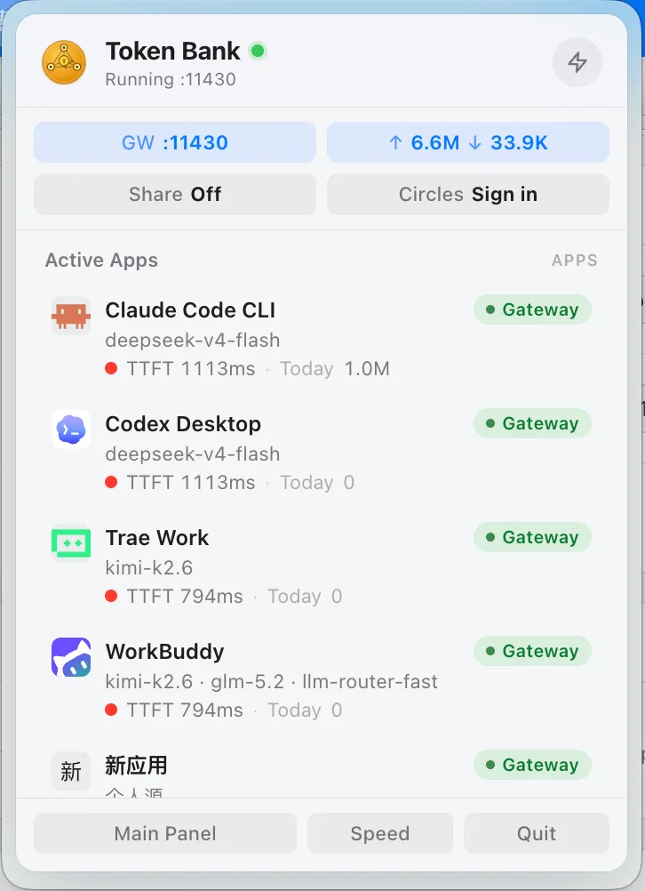

| 页面 | 功能 |
|---|---|
| **盘点** | 多维统计：应用占比、**本地源 / 社区分享** 分布、模型排行、压缩节省、费用估算；**工作画像分享海报** |
| **网关** | **一键纳管**（含 WorkBuddy / Trae 等）+ **CLI 多账号**；会话 Trace；场景 / 任务分型路由 |
| **调试 / 游乐场** | **Agent 聚合编排**（含社区智能体、图片输入）；工具流、停止续接 |
| **资源** | 社区推荐 **MCP / Skill / Prompt / Agent**；投射门控；**内置 MCP 中转**；画像推荐 |
| **供给源** | **本地源**与 **社区分享源**；模态（文本/图文/生图/嵌入）；测速与动态目录 |
| **圈子 / 贡献 / 网络** | 圈子共享 · 贡献节点 / **雇佣智能体** · 全球节点地图（网页亦可试用） |
| **配置** | 网关端口、超时、并发 · 无损压缩 · 云端账号与转发 Key |

---

## 接入任意 OpenAI 兼容客户端

```bash
# Claude Code（也可在网关页一键纳管，自动注入 ANTHROPIC_BASE_URL）
export ANTHROPIC_BASE_URL=http://localhost:11430

# Codex CLI（网关页纳管后自动注入 OPENAI_BASE_URL）
export OPENAI_BASE_URL=http://localhost:11430/v1

# Cursor / Copilot 等
OPENAI_BASE_URL=http://localhost:11430/v1
OPENAI_API_KEY=your-local-key

# curl 测试
curl http://localhost:11430/v1/chat/completions \
  -H "Authorization: Bearer your-local-key" \
  -H "Content-Type: application/json" \
  -d '{"model":"gpt-4o","messages":[{"role":"user","content":"你好"}],"stream":true}'
```

> 推荐在 **网关** 页一键纳管，无需手动改环境变量；选择路由后 Agent 仍显示原生模型名，网关透明转发至第三方模型。应用配置页可查看并试用已绑定的资源与 MCP。

---

## 搭建私有 P2P 后端（可选）

如果你想自建服务节点而不是使用公共网络：

```bash
cp .env.example .env
# 编辑 .env，设置 ADMIN_KEY
docker compose up proxy -d
```

| 变量 | 说明 |
|---|---|
| `ADMIN_KEY` | 管理后台密钥 |
| `REQUEST_TIMEOUT` | 单次转发超时秒数（默认 120） |

- 管理后台：`http://YOUR_VPS:8000/admin/ui`
- 用户门户：`http://YOUR_VPS:8000/app`
- Worker 接入：`ws://YOUR_VPS:8000/ws/worker`

### 贡献 Worker 节点

```bash
cd agent && pip install -r requirements.txt

python agent.py register \
  --server   "ws://YOUR_VPS:8000/ws/worker" \
  --worker-key "wk-... 在用户中心复制" \
  --models   "llama3,qwen2" \
  --llm-url  "http://localhost:11434" \
  --name     "我的主机"

python agent.py start
```

**上游 API Key 不上云**：仅存本机 `~/.llm-agent/config.json`，注册时只传 worker_key 和模型名。

---

## 许可证

Apache License 2.0 — 详见 [`LICENSE`](./LICENSE) 与 [`NOTICE`](./NOTICE)。  
再分发或衍生作品须保留 NOTICE，并注明来源：  
**Token Bank · https://github.com/wink-run/tokenbank**

---

## 免责声明

本项目仅供学习与研究使用。使用者须自行遵守所在地法律法规及上游服务条款。因部署、共享算力或转发请求产生的任何后果，均由使用者自行承担。
